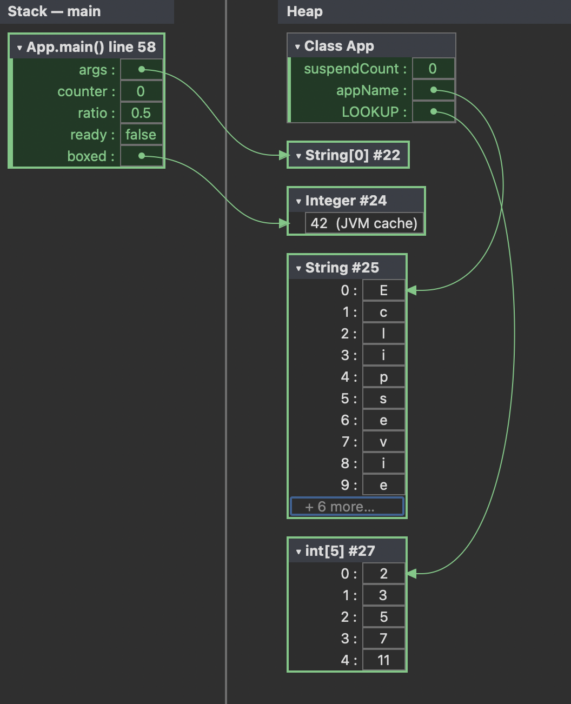

# Debug Memory View

[](https://github.com/ethan-godden/DebugMemoryView/actions/workflows/build.yml)
-2C2255)

[](https://www.eclipse.org/legal/epl-2.0/)

An Eclipse plug-in that draws a **live memory diagram of a suspended Java debug session** — the
stack (frames + locals), the heap (objects, arrays, strings, boxed values, enums), and static
fields — as boxes and reference arrows on a Draw2d canvas. Between suspends it diffs consecutive
snapshots of the same thread and highlights what changed (**NEW / CHANGED / DELETED**); deleted
items render exactly once as translucent *ghosts*.

The plug-in contributes a view named **Memory Diagram** (in the **Debug** category). The bundle is
`DebugMemoryView`; the installable feature is labelled *Debug Memory View*.

<p align="center">
  
</p>

## Features

- **Stack column** — one collapsible box per stack frame, showing `this` then each local as an
  `identifier : value` row.
- **Heap column** — a box per heap object, rendered by kind: plain objects (one row per field),
  arrays (indexed element rows, length in the title), strings (indexed character cells with the full
  quoted text in the header tooltip), boxed primitives (tagged `(JVM cache)` when JVM-cached), enum
  constants, and unexplored stubs (`(not explored)`).
- **Statics** — each class with static fields renders as its own box at the top of the heap column
  (toggleable).
- **Change highlighting** — items that appeared, changed, or vanished since the previous suspend of
  the same thread are coloured NEW / CHANGED / DELETED, with deleted items shown once as translucent
  ghosts. Colours are theme-aware (detected from the workbench background) and customizable.
- **Reference arrows** — value boxes that hold a reference draw an arrow to their target. Hovering a
  reference row previews the target object; clicking it scrolls to the target and flashes its outline.
- **Bounded extraction** — the JDI walk is capped (objects, depth, array elements, fields, string
  length) so large or cyclic object graphs never hang the debugger; over-cap items collapse to a
  clickable `+ N more…` expander.
- **Controls** — a **Pin** toggle to freeze the current diagram, **Statics**, **Expand/Collapse
  All**, **Refresh**, per-view render caps (Max Heap Objects / Fields per Object / Array Elements),
  and a **Highlight Changes** toggle. Native scrollbars are hidden — a lightweight overlay thumb
  appears while scrolling; plain wheel scrolls a column, Shift+wheel (or a trackpad horizontal swipe)
  scrolls the whole view.

## How it works

Data flows one way, from the debug session to the canvas:

```
DebugContextTracker → SnapshotPipeline → SnapshotExtractor → MemorySnapshot
      (listeners)      (debounced Job)       (JDI walk)        (immutable)
                                                                   │
MemoryDiagramView ← DiagramController ← MemoryDiff ← DiffEngine ←──┘
     (ViewPart)       (Draw2d figures)   (per-thread baseline diff)
```

All JDI wire calls happen on a background Jobs worker thread; snapshots and diffs are immutable and
are handed to the view on the UI thread, gated so a superseded snapshot is never displayed.

## Requirements

**To run the plug-in:**
- Eclipse IDE **2026-06 (4.40)** or newer (it depends on recent platform bundles — `jface` 3.39+,
  `draw2d` 3.23+, `jdt.debug` 3.26+, etc.).
- A **Java 21** runtime (the bundle's execution environment is `JavaSE-21`).

**To build from source, additionally:**
- A **JDK 21** (Eclipse Tycho 5.0.3 must itself run on Java 21).
- Maven (Tycho and the target platform are resolved automatically).
- Network access on the first build — it downloads the Eclipse 2026-06 target platform into `~/.m2`.

## Install (from a release)

1. Download the update-site archive **`DebugMemoryView-<version>-updatesite.zip`** from the
   [Releases page](https://github.com/ethan-godden/DebugMemoryView/releases).
2. In Eclipse: **Help ▸ Install New Software… ▸ Add… ▸ Archive…** and select the downloaded zip.
3. Expand the **Debug Memory View** category, check the feature, click **Next**, accept, then
   **Finish**. Restart Eclipse when prompted.
4. Open the view (see [Usage](#usage)).

> The release archive is a p2 update site — install it *as an archive*; you don't need to unzip it.

## Usage

1. Open the view: **Window ▸ Show View ▸ Other… ▸ Debug ▸ Memory Diagram**. (In the Debug perspective
   it's also registered as a hidden shortcut stacked with the Variables view — not shown by default.)
2. Debug a Java program and suspend a thread — hit a breakpoint or step. The diagram renders on
   suspend and updates as you step; until then the view shows a placeholder.
3. Interact:
   - **Toolbar:** Pin · Statics · Expand All · Collapse All · Refresh.
   - **View menu (▾):** Max Heap Objects (100/200/500) · Max Fields per Object (8/16/32) · Max Array
     Elements (10/25/50) · Highlight Changes.
   - **Hover** a reference row for a preview of its target; **click** it to scroll to and flash the
     target box. Click any box header to collapse/expand it.
4. Customize colours at **Window ▸ Preferences ▸ Memory Diagram** — toggle change highlighting and set
   the New / Changed / Deleted accents (Restore Defaults returns the theme-aware built-ins).

## Build from source

There is no `pom.xml` at the repository root (the root doubles as the Eclipse workspace); the Maven
reactor parent lives in `parent/`, so build with `-f parent`:

```sh
# Tycho requires Java 21. If your default `mvn` runs on an older JDK, point JAVA_HOME at a JDK 21:
JAVA_HOME=/path/to/jdk-21 mvn -f parent clean verify
```

This builds the target definition, the plug-in, the headless JUnit 5 test fragment, the feature, and
the p2 update site, and runs the tests. The update site is emitted to `repository/target/repository/`
and archived to **`repository/target/repository-<version>.zip`** — the same artifact that ships in a
release.

CI (`.github/workflows/build.yml`) runs the identical `mvn -f parent clean verify` on every push and
pull request and uploads the update-site zip as a build artifact.

## Run from source (development)

1. Open the repository root as your Eclipse workspace; each module (plus `parent/`) imports as its
   own project.
2. Run the checked-in launch config **`plugin/DebugMemoryView.launch`** (*Run As ▸ Eclipse
   Application*). It starts a runtime Eclipse using a `runtime-EclipseApplication/` workspace —
   created in the repo root on first launch and gitignored. (The launch targets the EPP *RCP and RAP
   Developers* product; adjust the launch's product if your host Eclipse doesn't provide it.)
3. In the runtime Eclipse, either create a small Java project or — for a ready-made set of programs
   that exercise every feature — do a one-time **File ▸ Import ▸ Existing Projects into Workspace**
   of the repo's `samples/` folder (leave *Copy projects into workspace* unchecked). Because the
   launch uses `clearws=false`, that import persists across later launches. Set a breakpoint (each
   sample's Javadoc names a good spot), debug it, and open the **Memory Diagram** view. See
   `samples/README.md`.

## Project layout

| Path | What it is |
|------|------------|
| `plugin/` | The plug-in (bundle `DebugMemoryView`, package `com.github.ethangodden.debugmemoryview`). |
| `tests/` | JUnit 5 test fragment of the plug-in (headless; reaches the plug-in's internal packages). |
| `feature/` | The installable Eclipse feature. |
| `repository/` | The p2 update site (`category.xml`); produces the shipped zip. |
| `targetplatform/` | The Tycho target definition pinning the Eclipse 2026-06 release train. |
| `parent/` | The Maven reactor parent (aggregates the modules; build entry point). |
| `samples/` | Plain Eclipse Java project of demo programs to debug against the view (not a Maven module; import in place into the runtime workspace). |

Releases are cut by pushing a version tag: `git tag v1.0.0 && git push origin v1.0.0` triggers
`.github/workflows/release.yml`, which builds, tests, and publishes the update-site zip as a GitHub
Release asset.

## Contributing

Issues and pull requests are welcome. By submitting a contribution you agree it is licensed under the
project's EPL-2.0 (inbound = outbound).

## License

Licensed under the **Eclipse Public License 2.0** (EPL-2.0) — see [`LICENSE`](LICENSE) for the full
text, or <https://www.eclipse.org/legal/epl-2.0/>.

`SPDX-License-Identifier: EPL-2.0`

Copyright (c) 2026 Ethan Godden.

## Author

Ethan Godden
